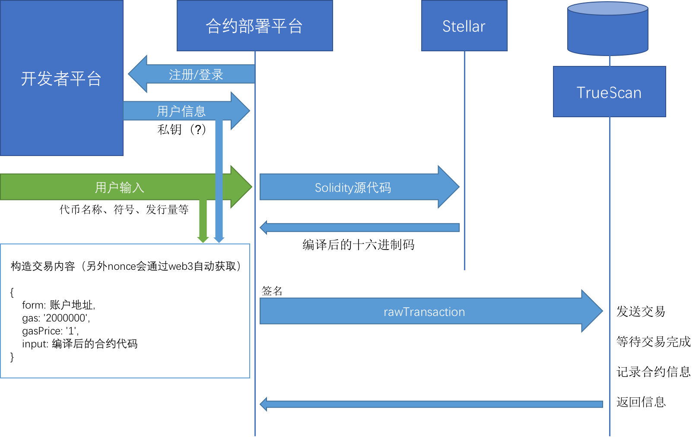

## ERC20代币合约一键部署功能

### 功能介绍
用户可以在平台内通过输入少量的信息，一键部署符合ERC20合约规范的代币合约，由中心化数据库记录合约相关信息，同时登记在[TrueScan](https://www.truescan.net)上。

### ERC20标准
ERC20标准及其衍生标准是目前最为流行的代币合约标准，主要实现了转账和授权转账的功能，以下是合约中规定的基本内容：
```solidity
contract ERC20 {
  string public constant name = "Token Name";
  string public constant symbol = "SYM";
  uint8 public constant decimals = 18;
  function totalSupply() constant returns (uint totalSupply);
  function balanceOf(address _owner) constant returns (uint balance);
  function transfer(address _to, uint _value) returns (bool success);
  function transferFrom(address _from, address _to, uint _value) returns (bool success);
  function approve(address _spender, uint _value) returns (bool success);
  function allowance(address _owner, address _spender) constant returns (uint remaining);
  event Transfer(address indexed _from, address indexed _to, uint _value);
  event Approval(address indexed _owner, address indexed _spender, uint _value);
}
```
在此基础上，平台部署合约时还添加了便于空投代币的发行总量`uint256 totalSupply`和空投方法`distribute(address,uint256)bool`。另外还有可选的更换创始人`changeFounder(address)`、删除合约`kill()`方法。  
用户需要输入代币名称`string name`，代币符号`string symbol`，发行总量`uint256 totalSupply`（用户只需要输入整数部分）。其中ERC20标准中的小数位数`uint256 decimals`默认设置成较为通用的18，而不是让用户输入。

### 合约部署流程
合约部署过程中使用到了多个平台的资源，具体流程为：



* 从开发者平台（暂无）调用相应的用户注册/登陆接口，获取用户账户相关的信息。  
目前由于开发者平台后台暂无，故仅能使用手动输入特定token以使用平台功能；

* 根据用户输入的关键参数，生成对应的ERC20合约；
* 通过（目前在）[Stellar](https://stellar.truechain.pro)平台提供的合约编译服务，将solidity源代码编译成十六进制编码的二进制码；
* 编译好的代码将会作为交易中`input`的部分被构造成交易，在前端使用`web3`中的的`accounts.signTransaction()`通过用户账户进行签名，得到签名后的交易内容`rawTransaction`；
* 签名后的交易内容会和其他元数据一起发送至[TrueScan](https://www.truescan.net)平台提供的ERC20合约部署接口，自动完成合约的部署和元数据的储存。至此代币合约部署完成，并且在区块链浏览器中记录了合约的相关信息。